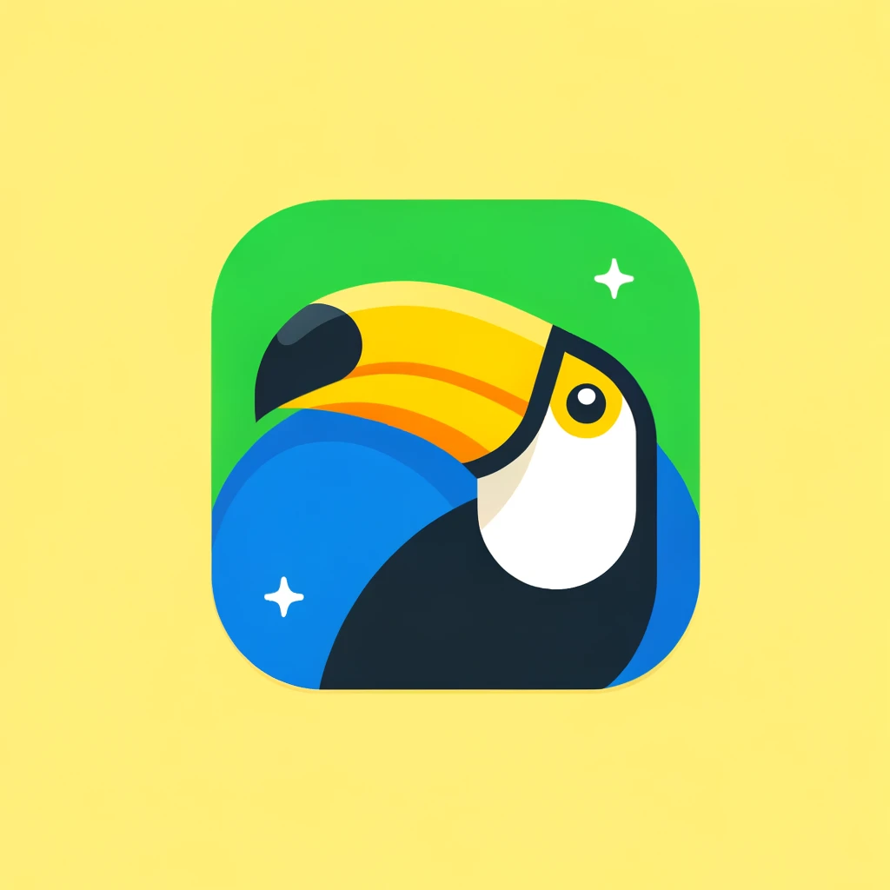

# Brazil Blog

[](https://github.com/drikusroor/brazil-blog/actions/workflows/ci.yml)



A blog about our trip to Brazil in October 2024. This project runs on Django + Wagtail in a Docker container. The styling is done with Tailwind CSS.

Currently hosted at [https://brazil.kokokoding.nl](https://brazil.kokokoding.nl).

## Getting Started

### Pre-requisites

- [Docker](https://www.docker.com/)
- [Docker Compose](https://docs.docker.com/compose/)
- [Bun](https://bun.sh)

### Docker

First, create a `.env` file, based on the `.env.example` file:

```bash
cp .env.example .env
```

To run the project:

```bash
docker-compose up -d

# Or, to rebuild the image:
docker-compose up -d --build
```

The project will be available at [http://localhost:8000](http://localhost:8000).

The admin panel will be available at [http://localhost:8000/admin](http://localhost:8000/admin).

To stop the project:

```bash
docker-compose down
```

### Tailwind CSS

To install dependencies:

```bash
bun install
```

To run:

```bash
bun tailwindcss:watch
```

To build:

```bash
bun tailwindcss:build
```

This project was created using `bun init` in bun v1.1.0. [Bun](https://bun.sh) is a fast all-in-one JavaScript runtime.
